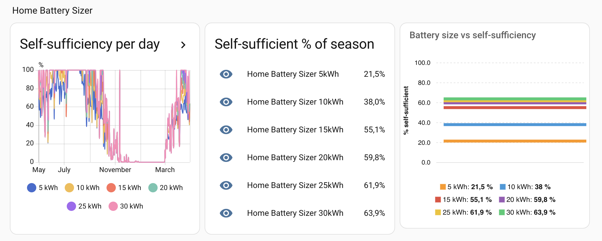

# Home Battery Sizer

A Home Assistant integration for homeowners with solar panels who are thinking about adding a home battery. It uses your own historical solar and grid data to simulate different battery sizes, so you can see the real impact before you buy.

## What you get

If you have solar panels, you're probably exporting surplus energy to the grid during the day and importing from the grid at night. A home battery lets you store that surplus and use it later — but what size do you actually need?

This integration answers that question using your own historical data. Add one entry per battery size you want to compare (e.g. 5, 10, 15, 20 kWh) and watch the sensors update side by side.

For each simulated battery size you get:

| Sensor | Description |
| --- | --- |
| Self-sufficient days | Days in the past year where solar + battery covered 100% of consumption |
| Self-sufficiency yesterday | Percentage of yesterday's consumption covered by solar + battery |
| First self-sufficient day | First day of the solar season (spring) |
| Last self-sufficient day | Last day of the solar season (autumn) |
| Max consecutive self-sufficient days | Longest unbroken streak of fully self-sufficient days |
| Solar season length | Calendar days between first and last self-sufficient day |
| Self-sufficient % of solar season | Percentage of solar-season days that were fully self-sufficient |
| Battery energy delivered | kWh the battery supplied to the house during the solar season |
| Grid export during solar season | kWh still exported to the grid despite the battery (surplus that didn't fit) |

The battery carries charge between days, so a sunny day can power the house through the following night and into the next morning — just like a real battery would.



[](https://my.home-assistant.io/redirect/hacs_repository/?owner=karl-petter&repository=home-battery-sizer&category=integration)

## Requirements

- Home Assistant with the Recorder integration enabled (default on most installs)
- At least a few months of history for the three energy sensors (a full year gives the best results)
- Three cumulative kWh sensors:
  - Solar production (e.g. from a Fronius, SolarEdge, or similar inverter)
  - Grid import (energy consumed from the grid)
  - Grid export (energy fed back to the grid)

Sensors are auto-detected from your [Energy dashboard](https://www.home-assistant.io/docs/energy/) if configured, otherwise you select them manually during setup.

## Installation

### Via HACS (recommended)

1. Open HACS in Home Assistant
2. Go to **Integrations** → click the three-dot menu → **Custom repositories**
3. Add this repository URL and select category **Integration**
4. Search for **Home Battery Sizer** and install it
5. Restart Home Assistant

### Manual

1. Copy the `custom_components/home_battery_sizer` folder into your HA `config/custom_components/` directory
2. Restart Home Assistant

## Setup

1. Go to **Settings → Devices & Services → Add Integration**
2. Search for **Home Battery Sizer**
3. Select your solar, grid import, and grid export sensors
4. Enter the battery size (kWh) you want to simulate

To compare multiple battery sizes, add the integration again with a different battery size. Each entry runs its own simulation independently.

## Visualising results

### Card 1 — Daily self-sufficiency over time

Each battery entry writes daily self-sufficiency percentages as an external statistic. Plot all battery sizes together using a **Statistics graph** card.

Add a new card, switch to the YAML editor, and paste:

```yaml
type: statistics-graph
chart_type: bar
title: Daily self-sufficiency
days_to_show: 21
stat_types:
  - mean
unit: "%"
entities:
  - entity: home_battery_sizer:self_sufficiency_daily_5kwh
    name: 5 kWh
  - entity: home_battery_sizer:self_sufficiency_daily_10kwh
    name: 10 kWh
  - entity: home_battery_sizer:self_sufficiency_daily_15kwh
    name: 15 kWh
  - entity: home_battery_sizer:self_sufficiency_daily_20kwh
    name: 20 kWh
  - entity: home_battery_sizer:self_sufficiency_daily_25kwh
    name: 25 kWh
  - entity: home_battery_sizer:self_sufficiency_daily_30kwh
    name: 30 kWh
```

Adjust the list to match the battery sizes you have configured. The statistic ID format is always `home_battery_sizer:self_sufficiency_daily_{size}kwh` (e.g. `_7_5kwh` for 7.5 kWh).

> **Note:** The visual editor will show validation warnings for these entries — that is expected. Save via the YAML editor and the card will render correctly.

### Card 2 — Battery size comparison (current values)

Shows the current solar-season self-sufficiency for each battery size as a list. No extra integrations needed.

```yaml
type: entities
title: Self-sufficient % of solar season
entities:
  - entity: sensor.home_battery_sizer_5_kwh_self_sufficient_of_solar_season
    name: 5 kWh
  - entity: sensor.home_battery_sizer_10_kwh_self_sufficient_of_solar_season
    name: 10 kWh
  - entity: sensor.home_battery_sizer_15_kwh_self_sufficient_of_solar_season
    name: 15 kWh
  - entity: sensor.home_battery_sizer_20_kwh_self_sufficient_of_solar_season
    name: 20 kWh
  - entity: sensor.home_battery_sizer_25_kwh_self_sufficient_of_solar_season
    name: 25 kWh
  - entity: sensor.home_battery_sizer_30_kwh_self_sufficient_of_solar_season
    name: 30 kWh
```

### Card 3 — Battery size vs self-sufficiency chart

Visualises the diminishing returns as battery size grows. Requires [apexcharts-card](https://github.com/RomRider/apexcharts-card) (available via HACS).

```yaml
type: custom:apexcharts-card
graph_span: 2h
header:
  show: true
  title: Battery size vs self-sufficiency (solar season)
apex_config:
  chart:
    type: bar
    height: 300
  plotOptions:
    bar:
      horizontal: false
      columnWidth: 70%
  dataLabels:
    enabled: true
    formatter: |
      EVAL:function(val) { return val ? val.toFixed(1) + '%' : ''; }
  yaxis:
    min: 0
    max: 100
    title:
      text: "% self-sufficient"
  xaxis:
    labels:
      show: false
    axisTicks:
      show: false
all_series_config:
  group_by:
    func: last
    duration: 2h
  show:
    legend_value: true
series:
  - entity: sensor.home_battery_sizer_5_kwh_self_sufficient_of_solar_season
    name: "5 kWh"
  - entity: sensor.home_battery_sizer_10_kwh_self_sufficient_of_solar_season
    name: "10 kWh"
  - entity: sensor.home_battery_sizer_15_kwh_self_sufficient_of_solar_season
    name: "15 kWh"
  - entity: sensor.home_battery_sizer_20_kwh_self_sufficient_of_solar_season
    name: "20 kWh"
  - entity: sensor.home_battery_sizer_25_kwh_self_sufficient_of_solar_season
    name: "25 kWh"
  - entity: sensor.home_battery_sizer_30_kwh_self_sufficient_of_solar_season
    name: "30 kWh"
```

## How it works

The simulation runs hourly across all available data (up to one year). For each hour:

1. Consumption is estimated as `solar + grid_import − grid_export` from your historical meter readings
2. Solar first covers consumption directly
3. Any surplus charges the battery (90% round-trip efficiency)
4. Any deficit draws from the battery, then falls back to grid import if the battery is empty

Battery charge carries over between hours and days. A day counts as "self-sufficient" if total grid import needed after the battery is factored in is less than 10 Wh.

Results update every hour.

## Simulation assumptions

The simulation models two real-world battery characteristics that you configure during setup:

- **Usable capacity** (default 90%) — batteries cannot use 100% of their rated kWh due to chemistry and internal losses. A new battery typically delivers 85–95% of its rated capacity; this figure decreases as the battery ages.
- **Minimum state of charge** (default 5%) — most batteries reserve a buffer at the bottom to protect cell longevity. Check your battery's manual for the exact figure.

Two simplifications remain:

- **No charge/discharge rate limit** — the simulation assumes the battery can absorb or deliver any amount within a single hour. Real inverters have a maximum power rating (e.g. 5 kW).
- **Fixed round-trip efficiency** — a flat 90% is applied to every charge cycle regardless of temperature or state of charge.

## Tips

- Add a 0 kWh entry (no battery) as a baseline to see your current self-sufficiency from solar alone
- Enter the battery's *rated* capacity during setup — the usable capacity and minimum SoC settings handle the rest
- Self-sufficient days will plateau as you increase battery size — the last few days of grid import are typically dark winter days that no realistic battery can cover
- The "max consecutive days" sensor shows the longest summer streak — useful for understanding how long a run of good weather the battery can sustain
